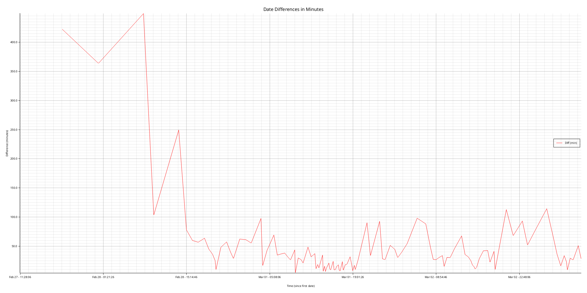

# Graph the time difference between two dates

Created by ChatGTP o3-mini-high see:
  https://chatgpt.com/share/67c47e77-66c4-800c-ad0c-c1cbada38d7a

## Run

Assumes a file named `dates.txt` with a series of dates one
per line in the current directory with the following format:
```
Mar 01 15:43:01
Mar 01 15:52:57
..
```

running with `cargo run` will output a graph of the time difference
for each date in the file.



## License

Licensed under either of

- Apache License, Version 2.0 ([LICENSE-APACHE](LICENSE-APACHE) or http://apache.org/licenses/LICENSE-2.0)
- MIT license ([LICENSE-MIT](LICENSE-MIT) or http://opensource.org/licenses/MIT)

### Contribution

Unless you explicitly state otherwise, any contribution intentionally submitted
for inclusion in the work by you, as defined in the Apache-2.0 license, shall
be dual licensed as above, without any additional terms or conditions.
